

  

# Alder

Open chemistry calculation results, build molecules, and make figures in one
desktop app. Your structures and calculation files stay on your computer.
**Viewing, editing, and figure exports work without ML models.**

**[Download for Windows](https://github.com/apounder/Alder/releases/download/Alder-v1.0/Alder-0.4.0-Windows-x64-GUI-Setup.exe)** ·
[Release notes](https://github.com/apounder/Alder/releases/tag/Alder-v1.0) ·
[Mac / Linux / Conda](#installation) · [Screenshots](#interface-and-results) ·
[Rendering styles](#rendering-styles)

## Desktop downloads

The Windows installer is available in the **[Alder-v1.0 prerelease](https://github.com/apounder/Alder/releases/tag/Alder-v1.0)**.
It supports Windows 10 (1809+) and Windows 11, x64.

1. Download **`Alder-0.4.0-Windows-x64-GUI-Setup.exe`** using the link above.
2. Open it and follow the installer. No separate Python, Git, or Conda installation is needed.
3. In **Set up Alder**, select optional models or uncheck them all for the viewer only.
4. Next time, open **Alder** from Start or its desktop shortcut, if selected during installation.

The build is unsigned. A **Portable.zip** is also available under the release's
**Assets**: extract the whole folder and open `Alder.exe`, keeping `_internal` beside it.

## Open your first file

1. Click **Open files**, or drag in a Gaussian `.log`, ORCA `.out`, or molecular `.xyz`.
   Try [this optimization example](tests/data/gaussian-opt.log): choose **Download raw file** on its GitHub page.
2. Drag to rotate, scroll to zoom, and click an energy point to inspect its geometry.
3. Choose a style under **View → Shared 3D appearance**, then click **Export figure**.

Results depend on the file: XYZ files contain geometry, while calculation outputs
may also include energies, orbitals, vibrations, or spectra.

## Interface and results

Screenshots from the running Windows app. Click an image to view it at full size.

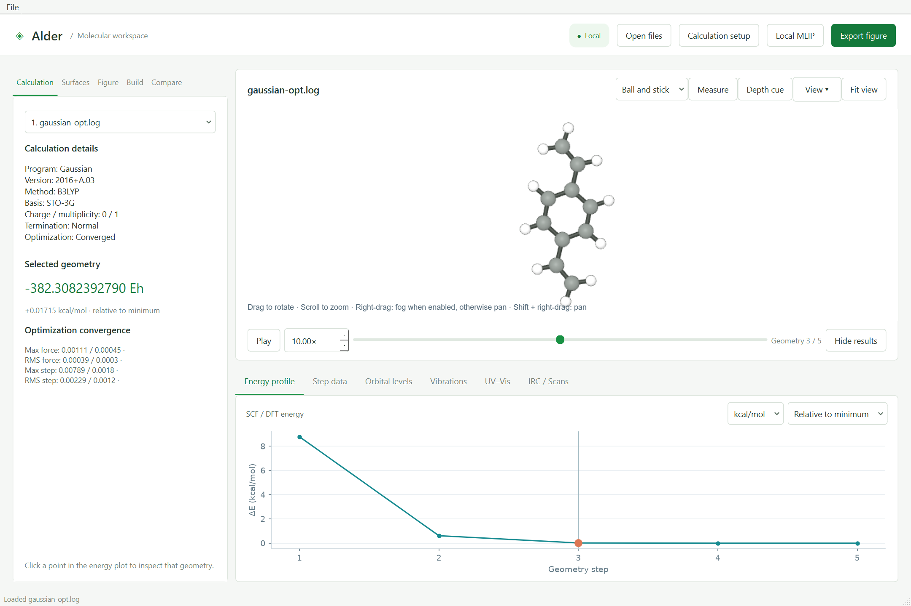

| Energy profile | Step data |
| --- | --- |
| 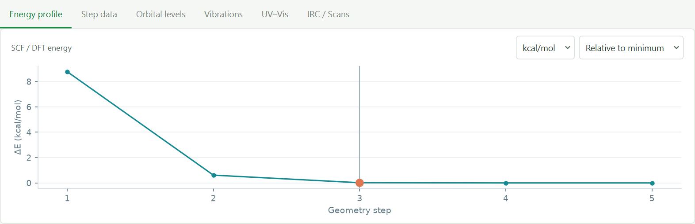 | 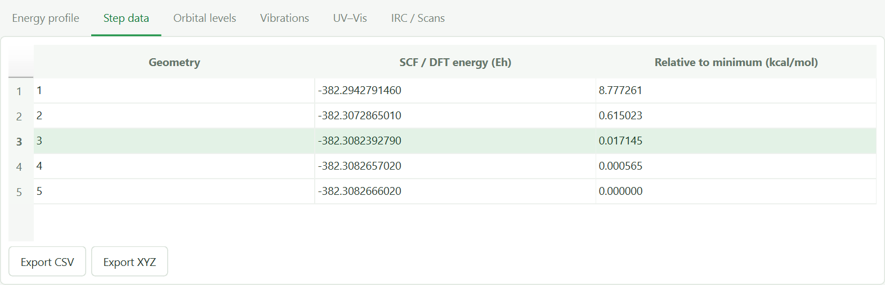 |
| **Orbital levels** | **Vibrations** |
| 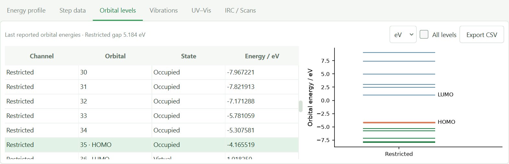 | 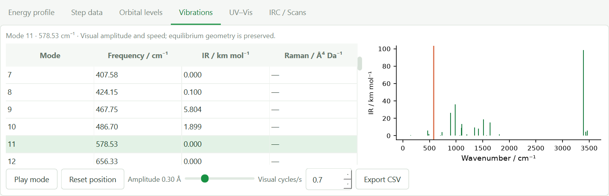 |
| **UV–Vis** | **IRC / Scans** |
| 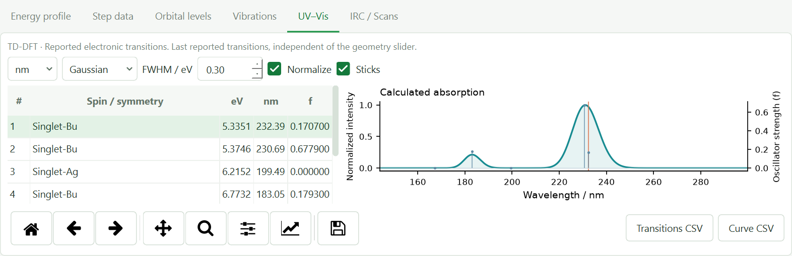 | 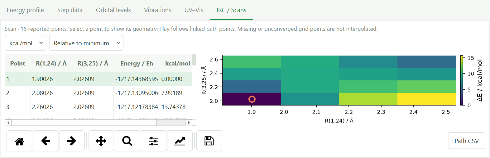 |
| **Molecule builder** | **Optional model setup** |
| 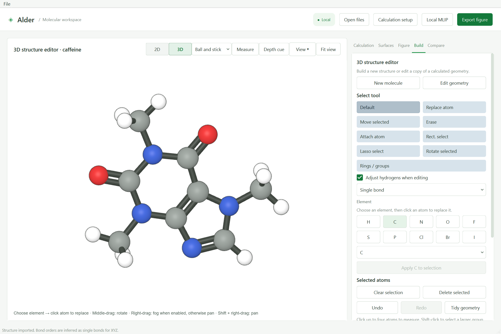 | 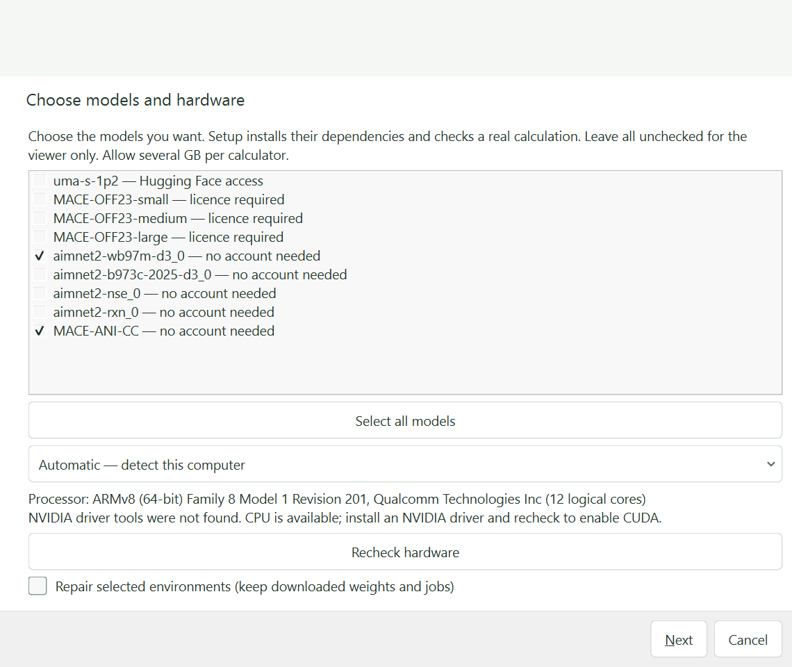 |

Explore the [example files](tests/data/README.md) or read the [usage guide](docs/USAGE.md).
Save edited molecules with **Export MOL** to preserve bond orders; builder drafts
are not saved automatically when you close the app.

## Rendering styles

Choose a preset under **View → Shared 3D appearance**. These exports show the
same illustrative caffeine geometry in all eight styles.

| Studio | Paton-inspired |
| --- | --- |
|  | 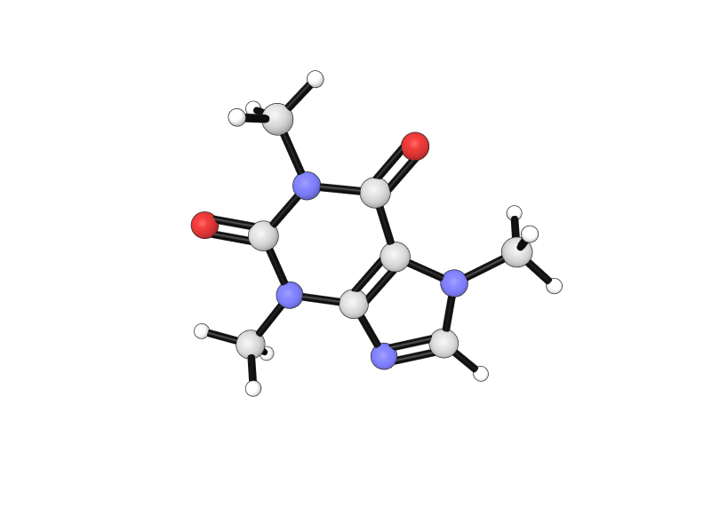 |
| **Soft studio** | **Flat** |
|  |  |
| **Tube** | **Ball and tube** |
| 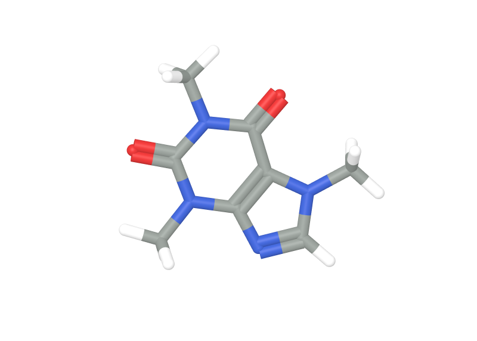 | 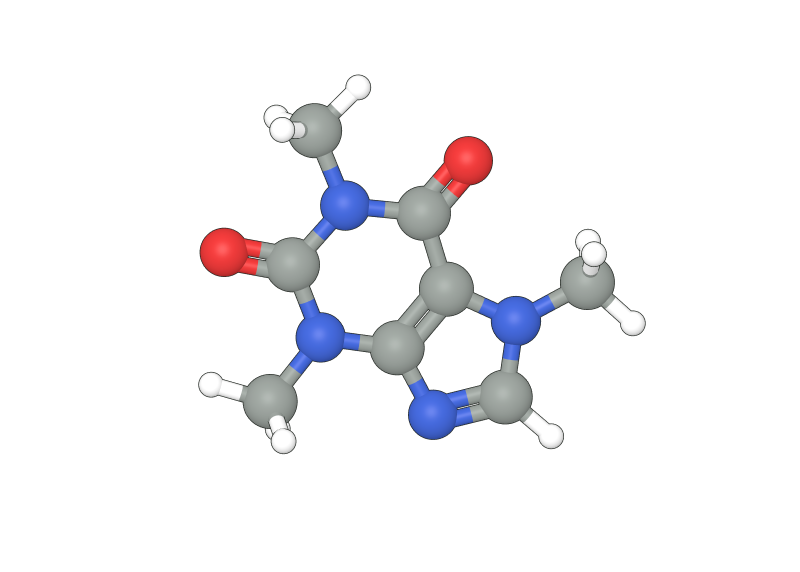 |
| **Wire** | **vdW** |
|  | 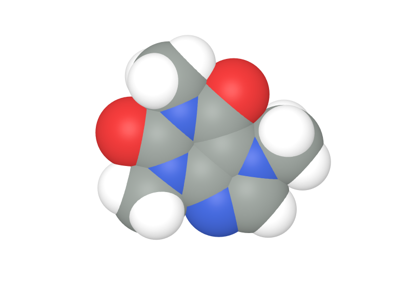 |

| Ray tracing | Contact lines and vdW overlay |
| --- | --- |
| 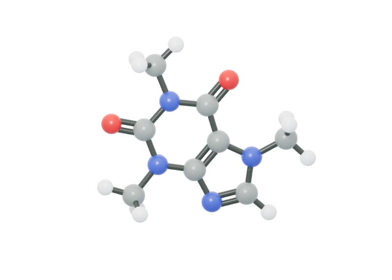 | 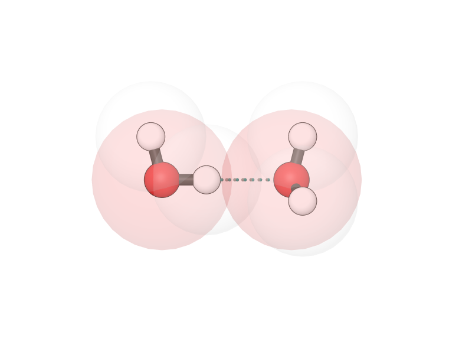 |
| **Figure → Renderer → Ray traced · physical lighting** | **Figure → Figure add-ons** |

Flat, Tube, Ball and tube, Wire, and vdW are inspired by
[xyzrender](https://xyzrender.readthedocs.io/en/latest/configuration.html).
Contact lines suggest likely interactions from geometry; they are not
electron-density NCI surfaces or calculated interaction energies.
[More rendering details](docs/USAGE.md#usage).

## Installation

For Mac and Linux, install from a terminal to open the same GUI. Windows users
can also choose a source or Conda installation instead of the installer.

| Your setup | Step-by-step guide |
| --- | --- |
| macOS | [Python, Git, installation, and later launches](docs/INSTALLATION.md#macos) |
| Linux desktop | [System libraries, installation, and later launches](docs/INSTALLATION.md#linux) |
| Windows from source | [PowerShell installation](docs/INSTALLATION.md#windows) |
| Windows with Conda | [Anaconda / Miniforge installation](docs/INSTALLATION.md#windows-with-conda) |
| Other Conda setups | [Conda installation](docs/INSTALLATION.md#2-conda) |

The Mac runtime remains experimental; optional Mac calculations use CPU.
[Setup prompts and troubleshooting](docs/INSTALLATION.md#finish-the-terminal-setup)
cover viewer-only installation, adding models later, and resuming interrupted setup.

## Optional models and Hugging Face access

To run local calculations, open **Local MLIP → Environment / models → Guided setup**.
Choose models and CPU or supported NVIDIA hardware. Downloads need internet and
several GB of storage; installed models are reused on later launches.

| Model | Access needed |
| --- | --- |
| AIMNet2, MACE-ANI-CC | No account required. Select them in Guided setup. |
| UMA (`uma-s-1p2`) | Hugging Face approval and a read token. |
| MACE-OFF23 | Read the [model licence](https://github.com/ACEsuit/mace-off) and acknowledge it in setup. |

### Get access to UMA, step by step

1. Sign into [Hugging Face](https://huggingface.co/join) and request access on the
   [official UMA page](https://huggingface.co/facebook/UMA).
2. Once approved, create a [read token](https://huggingface.co/settings/tokens)
   with permission to access `facebook/UMA`.
3. Select UMA in Alder's **Guided setup** and paste the token into the masked
   **Hugging Face read token** field. Continue through installation and verification.

A token alone does not grant model approval. See the [model guide](docs/MLIP.md)
for supported models and repairs, and the [validation record](docs/MLIP_ACCEPTANCE.md)
for current testing limits.

## More help

- [Installation and troubleshooting](docs/INSTALLATION.md)
- [Using Alder](docs/USAGE.md)
- [Local MLIP calculations](docs/MLIP.md)
- [Features and limitations](ALDER_CAPABILITIES.md)
- [Building and publishing the Windows installer](packaging/RELEASING.md)

Development

Use Python 3.11+ and Git. In a virtual environment, run `python -m pip install ".[dev]"`,
then `alder`. Run Python tests with `python -m pytest -q`; GUI smoke tests need a
graphical session. See [web development](web/README.md) for renderer changes.
Regenerate these screenshots with `python scripts/capture_readme.py`.

